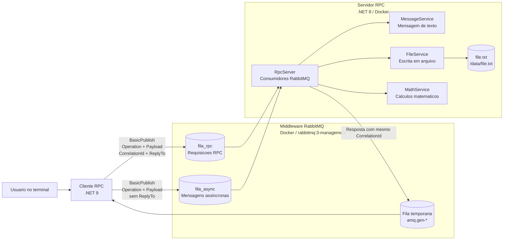
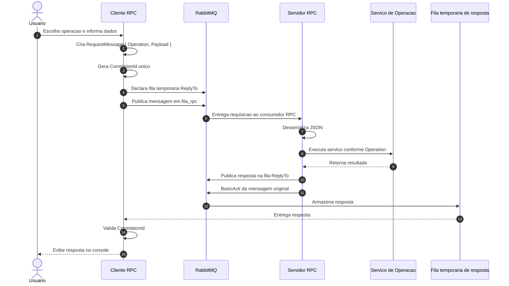
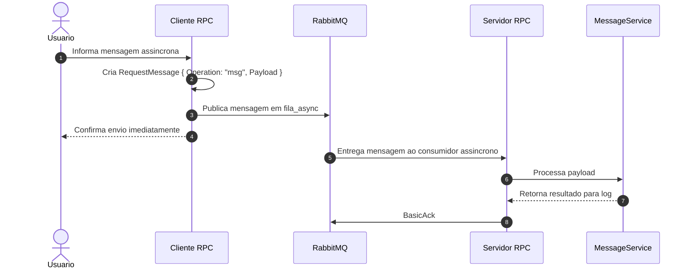
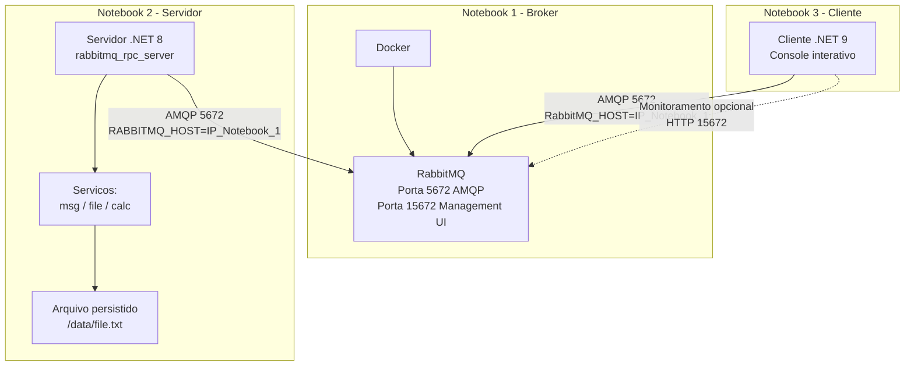
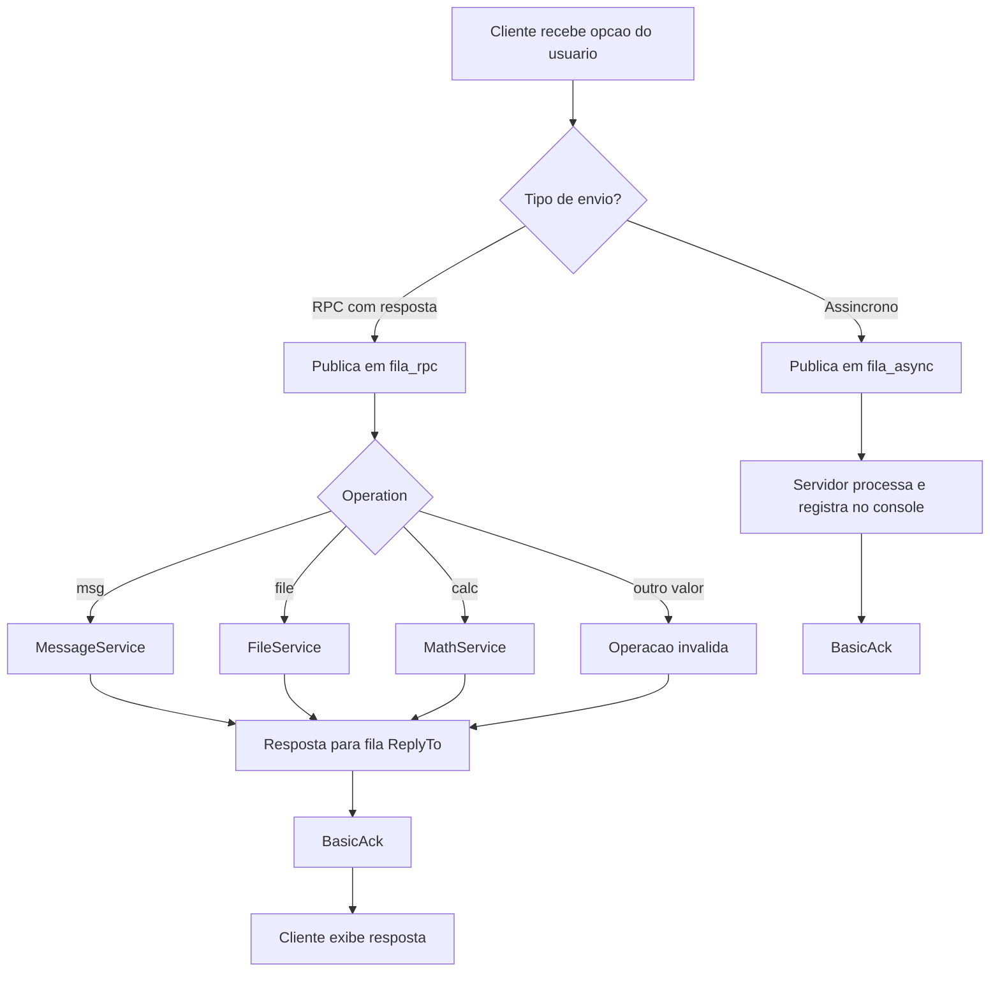

# Arquitetura do Prototipo - RabbitMQ

## 1. Visao Geral da Arquitetura

O prototipo demonstra comunicacao distribuida entre processos usando o **RabbitMQ** como middleware de mensageria. A aplicacao cliente nao chama diretamente os metodos do servidor. Em vez disso, ela envia mensagens para filas gerenciadas pelo broker RabbitMQ. O servidor consome essas mensagens, executa a operacao solicitada e, no caso RPC, publica a resposta em uma fila temporaria criada pelo proprio cliente.

O sistema suporta dois padroes de comunicacao:

- **RPC sincrono com resposta:** usado para mensagem de texto, escrita em arquivo e calculos matematicos.
- **Envio assincrono fire-and-forget:** usado para demonstrar processamento sem bloqueio do cliente.

## 2. Componentes do Sistema

| Componente | Tecnologia | Papel na arquitetura |
|---|---|---|
| Cliente RPC | C# / .NET 9 | Interface de console usada pelo usuario. Cria requisicoes, publica mensagens no RabbitMQ e aguarda respostas quando a operacao e RPC. |
| RabbitMQ Broker | RabbitMQ 3 Management / Docker | Middleware central. Recebe, enfileira, roteia e entrega mensagens entre cliente e servidor. Exibe monitoramento na porta 15672. |
| Servidor RPC | C# / .NET 8 / Docker | Processo consumidor. Le mensagens das filas, identifica a operacao solicitada e aciona o servico correspondente. |
| MessageService | C# | Processa mensagens simples e retorna confirmacao com timestamp. |
| FileService | C# | Persiste conteudo enviado pelo cliente em arquivo no servidor. |
| MathService | C# | Executa operacoes matematicas como soma, subtracao, multiplicacao, divisao, potencia, modulo e raiz. |
| Fila `fila_rpc` | RabbitMQ Queue | Canal principal para requisicoes RPC que exigem resposta. |
| Fila `fila_async` | RabbitMQ Queue | Canal para mensagens assincronas, sem resposta ao cliente. |
| Fila temporaria de resposta | RabbitMQ Queue auto-gerada | Criada pelo cliente a cada chamada RPC para receber a resposta do servidor. |

## 3. Implantacao Distribuida Demonstrativa

Na demonstracao, a arquitetura pode ser executada em maquinas diferentes para evidenciar a comunicacao distribuida.

- **Notebook 1:** RabbitMQ via Docker, expondo as portas `5672` e `15672`.
- **Notebook 2:** Servidor RPC, conectado ao RabbitMQ pelo hostname/IP do Notebook 1.
- **Notebook 3:** Cliente RPC, conectado ao RabbitMQ pelo IP do Notebook 1.

Em uma execucao simplificada, RabbitMQ e servidor podem rodar juntos via `docker-compose`, e o cliente pode rodar em outro notebook apontando `RabbitMQ_HOST` para o IP da maquina que hospeda o broker.

## 4. Diagrama de Componentes



## 5. Fluxo RPC Sincrono

Esse fluxo e usado nas opcoes do cliente que precisam de resposta: mensagem de texto, escrita de arquivo e calculos matematicos.



### Propriedades importantes do RPC

| Propriedade | Uso |
|---|---|
| `CorrelationId` | Identifica unicamente a chamada RPC. A resposta so e aceita pelo cliente se tiver o mesmo identificador. |
| `ReplyTo` | Informa ao servidor qual fila temporaria deve receber a resposta. |
| `BasicAck` | Confirma ao RabbitMQ que a mensagem foi processada com sucesso. |
| `BasicNack` | Usado quando ocorre erro e a mensagem deve ser rejeitada sem reenfileiramento. |
| `RPC_TIMEOUT` | Limite de espera do cliente pela resposta. O padrao do projeto e `5000` ms. |

## 6. Fluxo Assincrono Fire-and-Forget

Esse fluxo demonstra uma comunicacao desacoplada: o cliente envia a mensagem e nao fica bloqueado aguardando retorno.



## 7. Diagrama de Implantacao



## 8. Diagrama de Decisao de Operacao



## 9. Contrato de Mensagem

As mensagens trafegam como JSON codificado em UTF-8.

```json
{
  "Operation": "calc",
  "Payload": "soma,5,3"
}
```

Operacoes aceitas:

| Operation | Servico acionado | Exemplo de payload |
|---|---|---|
| `msg` | `MessageService` | `Ola servidor` |
| `file` | `FileService` | `Texto a ser salvo no arquivo` |
| `calc` | `MathService` | `soma,5,3` |

## 10. Ferramentas, Bibliotecas e Dependencias

| Item | Versao/uso no projeto |
|---|---|
| C# | Linguagem principal do cliente e servidor |
| .NET SDK | Cliente em .NET 9; servidor em .NET 8 |
| RabbitMQ.Client | Biblioteca AMQP usada no C#; versao `6.8.1` |
| RabbitMQ | Broker de mensagens; imagem `rabbitmq:3-management` |
| Docker | Execucao containerizada do RabbitMQ e do servidor |
| Docker Compose | Orquestracao local dos containers |
| Mermaid | Diagramas para relatorio, slides ou Markdown |

## 11. Decisoes Arquiteturais

| Decisao | Justificativa |
|---|---|
| Uso de RabbitMQ como broker central | Desacopla cliente e servidor, permitindo comunicacao por filas e execucao em maquinas diferentes. |
| Separacao entre `fila_rpc` e `fila_async` | Deixa claro o contraste entre chamada com resposta e processamento sem resposta. |
| Fila temporaria para resposta RPC | Permite que cada chamada tenha seu canal de retorno e seja correlacionada com `CorrelationId`. |
| Servicos por operacao | Facilita extensao do prototipo: novas operacoes podem ser adicionadas criando novos servicos. |
| Docker para RabbitMQ e servidor | Reduz variacao de ambiente e facilita demonstracao em laboratorio. |
| Interface de console no cliente | Mantem foco na comunicacao distribuida, sem complexidade visual desnecessaria. |

## 12. Pontos para Apresentacao

- O RabbitMQ atua como **middleware de comunicacao**, evitando que cliente e servidor dependam de chamadas diretas.
- A arquitetura mostra **desacoplamento espacial**: cliente e servidor so precisam conhecer o broker.
- O fluxo RPC usa `CorrelationId` e `ReplyTo` para simular uma chamada remota com resposta.
- O fluxo assincrono evidencia que o cliente pode continuar sua execucao sem aguardar processamento.
- O prototipo e distribuido porque cliente, servidor e broker podem rodar em maquinas diferentes usando rede local.
- A interface web do RabbitMQ permite observar filas, conexoes e mensagens durante a demonstracao.


